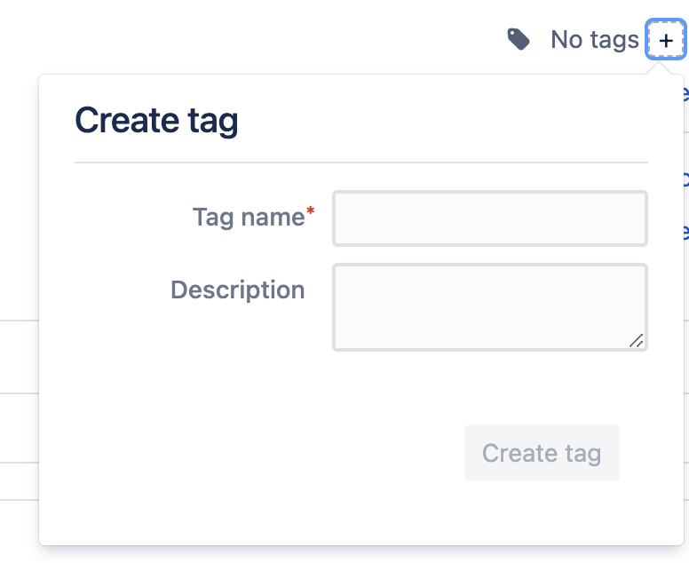

This folder contains `Dockerfile`, a configuration file to build the Docker image for tii-claasp. To run the docker
image, simply execute `make rundocker` from the root folder of tii-claasp.

###  Building the image from the pipeline ###
1. Make changes in the [Dockerfile](Dockerfile)
2. Test the image
3. Tag the commit with the changes.
3.1 In Bitbucket go to Commits, find your commit and click on it
3.2 Click on the plus button next to *No Tags*  
After the tagged build passes your image will be tagged as latest and all the changes will exist in tii-claasp agent.   