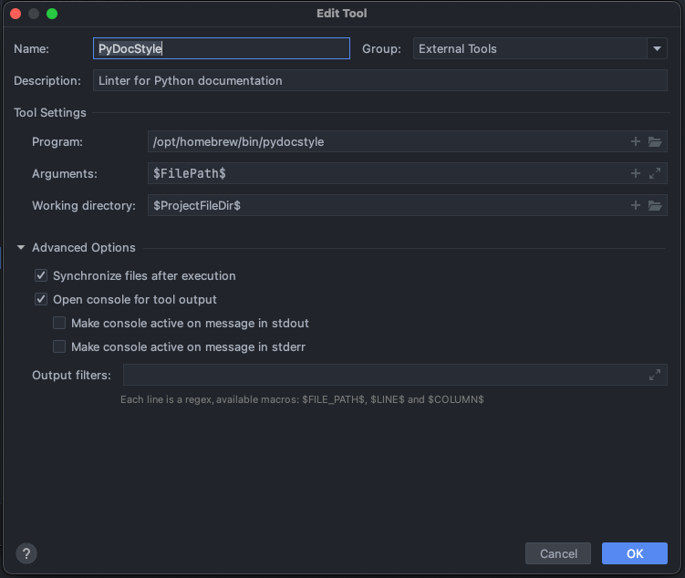

# How to contribute
To contribute to this project, please, follow the following conventions.
- [Devalopment environment](#development-environment)
  - [Installation](#installation)
  - [Setting up PyCharm](#setting-up-pycharm)
  - [How to Configure linter and formatter](#how-to-configure-linter-and-formatter)
  - [How to use linter and formatter from the shell](#how-to-use-linter-and-formatter-from-the-shell)
  - [Contributing to the Project](#contributing-to-the-project)
  - [Contributing to the documentation](#contributing-to-the-documentation)
- [Project structure](#project-structure)
- [GIT Conventions](#git-conventions)
  - [Branches](#branches)
  - [Pull Requests](#pull-requests)
- [Best practices for development](#best-practices-for-development)
  - [Linter/Formatter](#linterformatter)
  - [Imports](#imports)
  - [File arrangement](#file-arrangement)
  - [Comments and dead code in the code](#comments-and-dead-code-in-the-code)
  - [Nomenclature](#nomenclature)
  - [Single quotes VS double quotes](#single-quotes-vs-double-quotes)
  - [Single underscore VS double underscore](#single-underscore-vs-double-underscore)
  - [C code](#c-code)
- [Testing](#testing)
  - [Running tests](#running-tests)
  - [Deprecation warnings](#deprecation-warnings)
- [Code analysis with SonarCloud](#code-analysis-with-sonarcloud)
  - [Project overview](#project-overview)
  - [Coverage](#coverage)
  - [Security Review](#security-review)
  - [Duplications](#duplications)
  - [Issues](#issues)
  - [It should be noted that...](#it-should-be-noted-that)
- [Changelog versioning](#changelog-versioning)
  - [Versioning](#versioning)
  - [How it works](#how-it-works)
    - [Commits structure for version update](#commits-structure-for-version-update)
    - [Commits structure for Changelog update](#commits-structure-for-changelog-update)
    - [Example](#example)

# Development environment

## Installation

Download the source from the git repository:

```
     $ git clone https://github.com/Crypto-TII/claasp.git
     $ cd claasp/
```

CLAASP library is built on the top of SageMath, and it will try to pick the `sage` binary from `PATH`
environment variable. Alternatively, you can specify different sage binary in the file `SAGE_BIN_PATH` 
if you want to use other version of SageMath.

There are two different ways of getting the library ready to use, using docker or installing the dependencies on your 
machine. If you choose to use Docker, the dependencies will not be installed. These will remain inside your docker 
image and will be deleted as soon as you delete that image.

### Docker

In order to use this approach you need to have [docker](https://www.docker.com/) installed and up in your machine.
After we have installed and opened it we can run this command in the terminal, which will create the image and launch 
the container:

- In case you use a macOS machine with Apple Silicon chip (arm64), you need to run the command
   ```make rundocker-m1```

- Otherwise, run ```make rundocker```

After the installation, we need to enter to the sage terminal with the command:

   ```sage```

After that we are ready to go and can use the library as specified in the [User guide](USER_GUIDE.md).

### Manual installation
To install the dependencies manually, you only need to execute the following script from the 
root directory of the project:

    $ ./configure.sh

### Dockerfile modifications
Keep in mind that if you modify the Dockerfile, you will need to run `create_bash_script.py` to update the 
`configure.sh`script. 

## Setting up PyCharm

The following instructions have been tested with 
```angular2html
PyCharm 2021.2 (Professional Edition)
Build #PY-212.4746.96, built on July 27, 2021
```
1. Download and install [PyCharm](https://www.jetbrains.com/pycharm/download).
2. Determine location of the Python executable inside your sage package:
   1. open a terminal and type: 
   `sage -python` to open the Python shell from the sage package.
   2. within the Python shell, type: 
    ```angular2html
    >>> import sys
    >>> sys.executable
    # the output will be a path similar to this: '/your_sage_python_path/bin/python3'
    ```
3. Run PyCharm and open the `claasp/` directory

## Python interpreter

We will now set up PyCharm to use the Python 3 interpreter of SageMath
   1. Click `PyCharm` menu in the top-left toolbar and select `Preferences...`
   2. Click the drop-down menu of `Project: claasp` and select `Python Interpreter`
   3. Click the little-gear icon in the top-right corner next to the drop-down list of available interpreters and
      select `Add...`
   4. Select `Existing Environment`
   5. Click the `...` menu next to the drop-down list of interpreters
   6. Browse to the path found in point 2.
   7. If you set up the `PATH` environment variable correctly, PyCharm should successfully execute SageMath Python 3
      interpreter and populate list of packages installed.

After the steps above, you should now be able to:
1. Click on `Add Configuration...`.
2. Click on `Add new run configuration...`.
3. Select "Python".
4. Add the file to be run/debugged in the field "Script Path".

### Makefile configuration

Configure PyCharm's Makefile Plugin

1. Click `PyCharm` menu in the top-left toolbar and select `Preferences`
2. Go to `Plugins`
3. Install the `Makefile language` plugin

To use the targets in the Makefile, or to run the test for a specific module, you need to set a build configurations by
   following the steps below:

1. Click 'Run' in the top toolbar and select `Edit configurations`
2. Click the symbol `+` to add a new build configuration and choose `Makefile`
3. In the field `Name`, type the name of the configuration
4. In the field `Makefile`, choose the Makefile in the root folder of `claasp`
5. In the field `Targets`, choose the target you want to run (e.g. all, install, uninstall, etc)
6. In the field `Arguments`, type the argument you want to pass when `make <target>`. For examples, if you want to run
   the tests for `claasp/cipher_modules/algebraic_tests.py`, set `test` in the field `Targets` and type 
   `MODULE=claasp/cipher_modules/algebraic_tests.py` in the field `Arguments`.
7. In the field `Working Directory`, choose the root folder of `claasp`

## How to Configure linter and formatter
Developers use apps to help us improve the quality of our code. As every programming language has its own standards and good practises, we can take advantage of that and set/follow rules that can be automatically analysed and improved by our IDE (Integrated Development Environment).

In our case, in order to follow the best practises recommended for our (python) code we use the **Python standard** known as [PEP 8](https://peps.python.org/pep-0008/).

There are plenty of **tools** that can help you to follow this standard. We have chosen the following:

- Linter: reviews the code and documentation syntax based on the standard *pep8*. We will use *[pycodestyle](https://github.com/PyCQA/pycodestyle) + [pydocstyle](https://github.com/PyCQA/pydocstyle)*
- Formatter: automatically formats Python code. We will use *[autopep8](https://github.com/hhatto/autopep8)*, which uses the [pycodestyle](https://pypi.org/project/pycodestyle/) utility to determine what parts of the code needs to be formatted to conform to the [PEP 8](https://www.python.org/dev/peps/pep-0008/) style guide.

In order to configure this in our IDE we can follow the next steps:

1. Install the tools in your computer:
    1. [pycodestyle](https://pypi.org/project/pycodestyle/)
    2. [pydocstyle](https://pypi.org/project/pydocstyle/)
    3. [autopep8](https://pypi.org/project/autopep8/)
2. Create in the root of your project a **setup.cfg** file which will contain the configuration that the linter will follow.
    1. Example of the syntax of this file:
        
        ```
        [pycodestyle]
        max-line-length = 120
        
        [pydocstyle]
        ignore = D100, D101, D102, D107
        ```
        
        - Line 1 indicates the linter (for the code) that will be used to analyse the code.
        - Line 2 (in this example) overrides the default config for the max line length and sets it to 120 chars.
        - Line 4 indicates the linter for the documentation that will be used to analyse the documentation.
        - Line 5 tells the linter to ignore some specific [rules](https://pycodestyle.pycqa.org/en/latest/intro.html#error-codes) set by default (that how we can customise our analysis to ignore some rules that we disagree with, or we want to ignore for the time being).
        
        If you have doubts of how to use these tools you can always go to the shell/bash/terminal in your computer and use the *help documentation* in order to see the options you have got to add to this setup file. Typing for example:
        ```
        pydocstyle --h
        ``` 
3. We need to define the linter (**pycodestyle**) as an *External Tool*. (**Preferences → Tools → External Tools**). Click on the + symbol. (*A new window will be opened. The config below needs to be applied)*
    
    1. *Name*: your desired Name
    2. *Description*: your description
    3. *Program*: the location of the linter in your computer. (You can use the command *where* in bash to get it)
    4. *Arguments*: **$FilePath$**
    5. *Working directory*: **$ProjectFileDir$**
    
4. Same with **pycodestyle**:
    
5. Same with **autopep8**, but with some changes in the values:
    1. *Name*: your desired Name
    2. *Description*: your description
    3. *Program*: the location of the formatter in your computer. (You can use the command *where* in bash to get it)
    4. *Arguments*: **$FilePath$ -i -a -a**
        1. In this case, we put 2 flags that refer to:
            1. **i** : is the —in—place option
            2. **a**: defines the level of aggressiveness with which we want the analysis to be carried out. How many more -a, more level of aggressiveness.
    5. *Working directory*: **$ProjectFileDir$**
    

6. With this configuration, the tools could be used from the IDE from the menu *Tools*
    
    1. But, we would like the IDE to analyse and format automatically the files without us forcing it. So the next step would be defining the tools as *File Watchers*:
    2. Click on the + symbol and press in *<custom>* (*A new window will be opened. The config below needs to be applied)*
    
    3. To define the **pycodestyle**:
        1. *Name*: your desired Name
        2. *File type*: **Python**
        3. *Scope*: Project Files
        4. Program: the location of the formatter in your computer.
        5. *Arguments*: **$FilePath$**
        6. *Output paths to refresh*: **$FilePath$**
        7. *Working directory*: **$ProjectFileDir$**
   4. The same with the same values with **pydocstyle**:
       
       1. And **autopep8:**
       
7. In this way, the linter will perform analysis automatically whenever there are changes in a file, and the formatter will format the code automatically if we have autosave activated. So we need to activate it:


**With all this set, every time the code is saved, it will be analysed and formatted following the rules of PEP 8 and/or specified in the setup.cfg file.**

## How to use linter and formatter from the shell

Developers use apps to help us improve the quality of our code. As every programming language has its own standards and good practises, we can take advantage of that and set/follow rules that can be automatically analysed and improved by our IDE (Integrated Development Environment).

In our case, in order to follow the best practises recommended for our (python) code we use the **Python standard** known as [PEP 8](https://peps.python.org/pep-0008/).

There are plenty of **tools** that can help you to follow this standard. We have chosen the following:

- Linter: reviews the code and documentation syntax based on the standard *pep8*. We will use *[pycodestyle](https://github.com/PyCQA/pycodestyle) + [pydocstyle](https://github.com/PyCQA/pydocstyle)*
- Formatter: automatically formats Python code. We will use *[autopep8](https://github.com/hhatto/autopep8)*, which uses the [pycodestyle](https://pypi.org/project/pycodestyle/) utility to determine what parts of the code needs to be formatted to conform to the [PEP 8](https://www.python.org/dev/peps/pep-0008/) style guide.

The linter will follow the pep8 standard, but this standard can be slightly modified specifying some configuration in **setup.cfg** file that you can find in the root of your project.

Example of the syntax of this file:

```
1 [pycodestyle]
2 max-line-length = 120
3
4 [pydocstyle]
5 add-ignore = D100, D101, D102, D107
```

1. Line 1 indicates the linter (for the code) that will be used to analyse the code.
2. Line 2 (in this example) overrides the default config for the max line length and sets it to 120 chars.
3. Line 4 indicates the linter for the documentation that will be used to analyse the documentation.
4. Line 5 tells the linter to ignore some specific [rules](https://pycodestyle.pycqa.org/en/latest/intro.html#error-codes) set by default (that how we can customise our analysis to ignore some rules that we disagree with, or we want to ignore for the time being).

In order to be able to run the linter/formatter from the shell, open a new one and follow the instructions below to install them. You have also some examples on how to run each tool in its section.

### **pycodestyle**

Installation: [https://pypi.org/project/pycodestyle/](https://pypi.org/project/pycodestyle/)

```
**pip install pycodestyle**
```

Documentation: [https://pycodestyle.pycqa.org/en/latest/intro.html](https://pycodestyle.pycqa.org/en/latest/intro.html)

Command (this command needs to be executed in the shell from the path where the file/folder we want to analyse is located):

```
pycodestyle <file or folder>

# Examples:
# pycodestyle cipher.py
# pycodestyle iterative_cipher_classes/
```

### **pydocstyle**

Installation: [https://pypi.org/project/pydocstyle/](https://pypi.org/project/pydocstyle/)

```
**pip install pydocstyle**
```

Documentation: [http://www.pydocstyle.org/en/stable/](http://www.pydocstyle.org/en/stable/)

Command (this command needs to be executed in the shell from the path where the file/folder we want to analyse is located):

```
pydocstyle <file or folder>

# Examples:
# pydocstyle cipher.py
# pydocstyle iterative_cipher_classes/
```

### **autopep8**

Installation: [https://pypi.org/project/autopep8/](https://pypi.org/project/autopep8/)

```
**pip install autopep8**
```

Documentation: [https://github.com/hhatto/autopep8](https://github.com/hhatto/autopep8)

Command (this command needs to be executed in the shell from the path where the file/folder we want to analyse is located):

```
autopep8 --in-place --aggressive --aggressive <file or folder>

# Examples:
# autopep8 --in-place --aggressive --aggressive cipher.py
# autopep8 --in-place --aggressive --aggressive iterative_cipher_classes/
```

Flags we use in the command above: 

- *--in-place*: makes changes to files in place.
- *--aggressive --aggressive:* defines the level of aggressiveness with which we want the analysis to be carried out. (More amount of *-a* = more level of aggressiveness.)

***Note:*** If you have doubts of how to use these tools you can always go to the shell/bash/terminal in your computer and use the *help documentation* in order to see the options you have to add to this setup file. Typing for example:

```
pydocstyle --h
pycodestyle --h
autopep8 --h
```

## Contributing to the Project

1. Create a new ticket in JIRA
2. Set the `Project` field to be **Cryptographic Library for Automated Analysis of Symmetric Primitives (CLAASP)**
3. If the issue created is considered to be collection of many small tasks, then select `Story` as the `Issue Type`.
   Otherwise, set it to `Task` or a `Bug` depending on the context.
4. Give short description in the `Summary` in the following format
   ```
       <type>: <description>
   ```
   where `<type>` is either `feature`/`doc`/`bug`/`other`, i.e. "bug: incorrect computation of Walsh transform".
5. Set the appropriate `Due Date`
6. Give a clear and concise explanation of the issue in the `Description`
7. Select the `Fix Version` of the module
8. Put relevant keywords in the field `Labels`
9. If it is necessary to link the issue with existing ones, fill both the `Linked issue` and the `Issue` field.

Now suppose that you want to work on a ticket. We must associate the ticket to a specific branch in `claasp`
repository in the following way

1. Go to the ticket that you want to work on
2. In the right pane, select `Create branch`. You will be redirected to the GitHub.
3. Select the `claasp` in the `Repository` field
4. Choose `Custom` in the `Branch type`
5. Select the appropriate branch that you want to `Branch from`. Generally, this should be set to `main` or `develop`.
6. In the `Branch name`, make sure that it is filled with the same ID as the ticket, i.e. `LIBCA-26`.
7. Click `Create branch`

You may now work on changes you want to do on that specific branch you just created. Once this is done, create a pull
request and assign someone to review the changes. Do not forget to also change the `Assignee` field in the ticket to the 
person in charge of reviewing your code. If you are the reviewer, make sure that the changes in the pull request follows
[SageMath coding convention.](https://doc.sagemath.org/html/en/developer/coding_basics.html)

We agreed on some specifics that do not follow the convention linked above. These are:

- Both protected/private methods will have the suffix `_`.
- Component names like AND, OR, etc. inside a method name will always be in capital letters. `add_AND_component()`
- Create a PR to `develp` branch only when the functionality is completed

## Contributing to the documentation

You can add Documentation Strings in your code following the 
[SageMath documentation convention](https://doc.sagemath.org/html/en/developer/coding_basics.html#documentation-strings).

We agreed on some specifics that do not follow the convention linked above. These are:

- When specifying the type of input/output do it in bold. 
Like: ``` ``number_of_rounds`` -- **integer** (default: `1`); number of rounds for the cipher```.
- When adding an example tag, this needs to be exactly like `EXAMPLES::`, and leave an empty blank line before the 
example code.
- When there is no input to a method, ``None`` should be used to specify it 
- If the line is too long, it can be split in as many lines as needed, but always leaving 2 blank spaces of indentation.
```
run_avalanche_dependence_uniform -- **boolean** (default: `True`); if True, add the avalanche dependence
  uniform results to the output dictionary
```

If you need to add new references, you must insert them manually in the file `docs/references.rst` in order to build 
the documentation correctly.

# Project structure
This is the current project structure.

```bash
.
├── CHANGELOG.md
├── claasp
│  ├── cipher_modules
│  ├── cipher.py
│  ├── ciphers
│  ├── component.py
│  ├── components
│  ├── DTOs
│  ├── editor.py
│  ├── __init__.py
│  ├── input.py
│  ├── name_mappings.py
│  ├── round.py
│  ├── rounds.py
│  └── utils
├── claasp.egg-info
│  ├── dependency_links.txt
│  ├── PKG-INFO
│  ├── requires.txt
│  ├── SOURCES.txt
│  └── top_level.txt
├── configure.sh
├── conftest.py
├── CONTRIBUTING.md
├── create_bash_script.py
├── create_copyright.py
├── docker
│  ├── Dockerfile
│  ├── README.md
│  └── tag-build.png
├── docs
│  ├── build
│  ├── CIPHER.md
│  ├── conf.py
│  ├── create_rst_structure.py
│  ├── DEVELOPER_GUIDE.md
│  ├── images
│  ├── Makefile
│  ├── README.md
│  ├── references.rst
│  ├── theme
│  └── USER_GUIDE.md
├── LICENSE
├── Makefile
├── publish_documentation.py
├── README.md
├── required_dependencies
│  ├── assess.c
│  ├── utilities.c
│  └── utilities.h
├── run_update_changelog.sh
├── setup.cfg
├── setup.py
├── sonar-project.properties
├── structure.txt
├── tests
│  ├── cipher_modules
│  ├── ciphers
│  ├── cipher_test.py
│  ├── components
│  ├── editor_test.py
│  └── utils
├── update_changelog.py
├── venv
│  ├── bin
│  ├── lib
│  └── pyvenv.cfg
└── VERSION
```

# GIT Conventions
## Branches
- `main` is the main branch.
- `develop` is the branch where the latest changes are merged into.
- `<fix|feature|breaking>/<task-name>` is the branch where a new feature is developed.

> ⚠️ We encourage you to follow this convention when creating new branches even though branches with the naming 
> convention `<task-name>` are allowed. ⚠️ 

## Pull Requests
- Pull Requests should be made from a `feature-branch` to `develop` and it should be reviewed by at least one person.
- New branches to development tasks will have `develop` branch as origin. 
- The only allowed Pull Requests to `main` branch must come from `develop` branch. All other Pull Requests will be 
rejected.
- When a `develop` Pull Request to `main` is merged, a script will be executed to update the project version. See 
[Changelog versioning](#changelog-versioning) section.

# Best practices for development
The purposes of implementing these in our daily basis are:
- Keep a homogeneous code style throughout the project.
- Follow most of `PEP8` standard rules.
- Make code easier to read and understand.
- Reduce tendency to errors.
- Improve performance.

## Linter/Formatter
A best practice while developing is having a `linting` and a `formating` tool to help you follow the standard 
guidelines.
- **Linter**: reviews the code and documentation syntax based on the standard `Pep8`. We will use 
[pycodestyle](https://github.com/PyCQA/pycodestyle) + [pydocstyle](https://github.com/PyCQA/pydocstyle).
- **Formatter**: automatically formats Python code. We will use [autopep8](https://github.com/hhatto/autopep8), which 
uses the [pycodestyle](https://pypi.org/project/pycodestyle/) utility to determine what parts of the code needs to be 
formatted to conform to the `PEP8` style guide.

## Imports
- `PEP8` states a best practice to separate the end of the imports with the class or module definition by two blank 
lines. This **improves readability** and clearer knowledge of where the imports start and where they end.
```python
import numpy


class Calculator:
```

- We should **avoid to declare imports as**:
```python
from numpy import *
```
These type of imports bring everything that that module/file contains, even its own imports. This makes the cost of 
executing the code higher as it needs to resolve every import. Imagine that the module you are importing is importing 
other modules itself with this nomenclature, this can lead to cyclical imports or, in the worst case scenario, to 
import your hole project in the file without you even knowing. We should only import what we strictly need.

- When we need certain imports to make our string code to work, instead to adding them to the global imports, try to 
**import them where it is required only**. This will help us when we try to understand the code where those imports are 
really used. If we specify them globally, but they are only used in string code, probably our IDE will point to us that 
those imports are not used when they actually are.
```python
cipher_code_string = ""
cipher_code_string += "from copy import copy\n"
cipher_code_string += "from bitstring import BitArray\n"
cipher_code_string += "\n"
cipher_code_string += "def copy_array(input):\n"
```
This way of adding imports should also follow the recommendations described in this section.

- If we need to add a line of imports that is very long, specify those imports between parenthesis, this will help the 
formatter to split the import into multiple lines.
```python
from claasp.name_mappings import (INTERMEDIATE_OUTPUT, CIPHER_OUTPUT, CONSTANT, 
                                  WORD_OPERATION, MIX_COLUMN, SBOX)
```

## File arrangement
- `PEP8` states a best practice to leave a **blank line at the end of the file**.
- **Avoid writing infinite lines**. `PEP8` aims to have lines of less than 79 characters, we know that because of 
the nature of the project this would be nearly impossible to achieve, but we consider that writing lines of no more than 
120 characters can be achievable. This would mean a major improvement in readability.

## Comments and dead code in the code
- It is **not recommended to write comments in the code** unless they explain something specific that the code can't 
explain.
- It is a **bad practise having commented code**. When a piece of code is not needed, it needs to be removed. 
In case the programmer wants to recover it, he/she can do it from the version system control (Git).

## Nomenclature
- Variables, file names and methods should follow the same nomenclature as specified by `PEP8` 
[Naming Conventions](https://peps.python.org/pep-0008/#naming-conventions). This means to write them in snake_case 
avoiding usage of uppercase letters. In this project we have agreed to use uppercase notation for components naming. 
- On the other hand, for class naming we should use CamelCase avoiding the usage of underscore to separate the words.

## Single quotes VS double quotes
Below you can find what it is considered best practises, but the most important thing in this case, it is making an 
agreement among the team in order to use them in the same way, whether following best practises or not. 
- **Single quotes**: it's a best practice to use them to surround small and short strings, such as string literals or 
identifiers. But it's not a requirement. You can write entire paragraphs and articles inside single quotes. Example:
```python
name = 'Bob'
print(name)

channel = 'Better Data Science'
print(channel)

paragraph = 'Bob likes the content on Better Data Science. Bob is cool. Be like Bob.'
print(paragraph)
```
- **Double quotes**: It's considered a best practice to use them for natural language messages, string interpolations, 
and whenever you know there will be single quotes within the string. Example:
```python
name = 'Bob'

# Natural language
print("It is easy to get confused with single and double quotes in Python.")

# String interpolation
print(f"{name} said there will be food.")

# No need to escape a character
print("We're going skiing this winter.")

# Quotation inside a string
print("My favorite quote from Die Hard is 'Welcome to the party, pal'")
```

## Single underscore VS double underscore
- The use of single underscore is **related to protected variables and methods**, this means that no other object or 
method is able to reach them unless they are part of a child object (Inheritance).
- Double underscores are used to state that **methods are private** and no other objets can use them even if they are
children.
- In this project we have agreed to only use Single underscore notation for both purposes. 

## C-code
`PEP8` has a specific guideline on how to deal with  C code in the 
[C implementation of Python](https://peps.python.org/pep-0007/).

# Testing
The project uses **`Pytest` as it’s testing framework**. We can forget to write the example Docstrings as they will 
still be part of the documentation.
Our tests are stored in the `tests` folder that mimics the folder structure of `claasp`.

There are files in our `claasp` folder that are not in the `test` folder, this means that those files does not contain 
any tests. So every time we create a new file that should have tests in `claasp` we would need to create a new test 
file. Test files are named exactly the same as our `claasp` files, we just need to add `_test` at the end of the name. 

As an example `cipher.py` needs a test file called `cipher_test.py`.

Once we have created our test file, we need to create the test. The test file works as common Python files. So we need 
to declare our testing functions and our imports. Our function names follow the structure of 
`test_{name of the method we want to test}`.

- **Docstring**:
```bash
sage: from claasp.ciphers.block_ciphers.aes_block_cipher import AESBlockCipher
sage: aes = AESBlockCipher()
sage: key = 0x2b7e151628aed2a6abf7158809cf4f3c
sage: plaintext = 0x6bc1bee22e409f96e93d7e117393172a
sage: ciphertext = 0x3ad77bb40d7a3660a89ecaf32466ef97
sage: aes.evaluate([key, plaintext]) == ciphertext
True
```

- **Pytest**:
```python
from claasp.ciphers.block_ciphers.aes_block_cipher import AESBlockCipher


def test_aes_block_cipher():
    aes = AESBlockCipher()
    key = 0x2b7e151628aed2a6abf7158809cf4f3c
    plaintext = 0x6bc1bee22e409f96e93d7e117393172a
    ciphertext = 0x3ad77bb40d7a3660a89ecaf32466ef97
    assert aes.evaluate([key, plaintext]) == ciphertext
```

As you can see above, the `assert` keyword is the one that will check if our result is the one we expected. 
Apart from that, the structure of the test is very similar.

## Running tests
To run all the project test you can run `make pytest command`, but if you want to run specific things you can do:
- **Run specific file:**
```bash
pytest -v tests/cipher_test.py
```
- **Run specific test in file:**
```bash
pytest -v tests/cipher_test.py::test_algebraic_tests
```
- **Run the tests to show full log of error:**
```bash
pytest -vv tests/cipher_test.py
```
- **Run the tests to show prints and standard outputs:**
```bash
pytest -s tests/cipher_test.py
```

If we want a **specific test to be skipped** we will need to `import pytest` to the top of the file and add this 
following command with the reason of the test being skipped as the argument `@pytest.mark.skip("Takes to long")`:
```python
import pytest

from claasp.ciphers.block_ciphers.aes_block_cipher import AESBlockCipher

@pytest.mark.skip("Takes to long")
def test_aes_block_cipher():
    aes = AESBlockCipher()
    key = 0x2b7e151628aed2a6abf7158809cf4f3c
    plaintext = 0x6bc1bee22e409f96e93d7e117393172a
    ciphertext = 0x3ad77bb40d7a3660a89ecaf32466ef97
    assert aes.evaluate([key, plaintext]) == ciphertext
```

## Deprecation warnings
We might get sometime deprecation warnings. To avoid them we can import `pytest` to the top of the file and add this 
following command `@pytest.mark.filterwarnings("ignore::DeprecationWarning:")`:
```python
import pytest

from claasp.ciphers.block_ciphers.aes_block_cipher import AESBlockCipher

@pytest.mark.filterwarnings("ignore::DeprecationWarning:")
def test_aes_block_cipher():
    aes = AESBlockCipher()
    key = 0x2b7e151628aed2a6abf7158809cf4f3c
    plaintext = 0x6bc1bee22e409f96e93d7e117393172a
    ciphertext = 0x3ad77bb40d7a3660a89ecaf32466ef97
    assert aes.evaluate([key, plaintext]) == ciphertext
```

# Code analysis with SonarCloud
SonarCloud is a platform to evaluate the quality of the source code of a project detecting errors, vulnerabilities and 
bugs in software. Claasp SonarCloud project can be found 
[here](https://sonarcloud.io/project/overview?id=Crypto-TII_claasp).

## Project overview
SonarCloud is responsible for the analysis of our code once a pull request has been created.

We have two tabs in the general view:
- **New Code**: we find a detailed report on the code quality of the last push, taking into account only the new code 
and/or the modified code.
- **Overall Code**: shows the overall report of the project status.

## Coverage
The coverage of the project is the **percentage of lines of code that are covered by the tests**.
Clicking on the percentage or the number of lines takes us to the list of files.

## Security Review
A security hotspot is a piece of code that is sensitive to the security of the project and must be reviewed and fixed.

## Duplications
When we talk about duplications, we are referring to code already written in the project that is repeated several 
times. SonarCloud also tells us where these repetitions are occurring and will tell us the percentage of duplicated 
lines in our code.
Clicking on the percentage or the number of duplicate lines will take us to the list of files containing duplicate code.

## Issues
This section reflects the problems found in our code that we should fix. 

SonarCloud's report provides detailed information on each problem encountered as well as suggestions on how to solve it.

The problems are divided into 3 types:
- **Bugs**: problems that cause the code to behave incorrectly.
- **Vulnerabilities**: problems that can be exploited by attackers to compromise the confidentiality, integrity or 
  availability of the software.
- **Code Smells**: problems that affect the maintainability of the code.

The **severity** of the problems in our code are divided into 5 types:
- **Blocker**: the problem is critical and must be fixed immediately.
- **Critical**: the problem is critical and must be fixed as soon as possible.
- **Major**: the problem is important and should be fixed.
- **Minor**: the problem is not very important and should be fixed if possible.
- **Info**: the problem is not important and does not need to be fixed.

When the problem has been solved by updating our code, a new push re-runs the analysis process.
Similarly, when reviewing a problem detected in the SonarCloud report, if we consider that it is not a problem, we can 
mark it as "Resolved as won't fix".

## It should be noted that...
If in the new push there is more than **3% duplicate code** and/or the **test coverage is less than 80%** the pipeline 
analysis will fail, as well as, if there are new Security Hotspots and/or bugs in the code during a new push.

# Changelog versioning
To automate the project version increment, the script `update_changelog.py` has been created to be executed when a Pull 
Request is merged from the `develop` branch to the `main` branch.
This script analyzes the messages of the commits to determine the type of version increment and the information that 
should be added to the `CHANGELOG.md`.

> ⚠️ It is important to follow the following rules only in case we want to upgrade the project version at the end of the 
> task. Otherwise, do not follow the following rules as it will cause an unwanted change in the project version. ⚠️ 

## Versioning
There are three types of versioning changes, as you can check in [Semantic Versioning](https://semver.org/):

- [x.x.**x**] - **Patch** &rarr; When you make compatible bug fixes.
- [x.**x**.x] - **Minor** &rarr; When you add functionality in a compatible manner.
- [**x**.x.x] - **Major** &rarr; When you make incompatible changes.

## How it works
The information that is needed in order to update the new version will be taken from the messages of the commits of all 
the Pull Requests that have been merged into `develop`. This means, we will check the commits between the last two 
merges from `develop` to `main`. Those merge commits will have a message like this:
**"Merge pull request #x from Crypto-TII/develop"**.

### Commits structure for version update
The start of the commit messages must be created according to this structure, because of that depends on the type of 
change for the new version. These are the versioning keywords:

- For **patch** changes: **FIX/**
- For **minor** changes: **FEATURE/**
- For **major** changes: **BREAKING/**

We will look in the commits merged into `develop` to obtain the highest version change to be applied.

### Commits structure for Changelog update
The Changelog version sections will have this structure:
```markdown
## [4.2.0] - 2023-04-27

### Added

- Create new component.
- Create login form.

### Changed

- Update Version variables from destructuring list.
- Code refactorings in cipher.py.

### Fixed

- Update coverage path.

### Removed

- Remove commented code.
```

The selected commit messages to be included in the description of the new version must start with the next commit 
keywords or with the [commit structure for version update](#commits-structure-for-version-update) followed by the next 
keywords.

- **Add: → Added**
- **Feat: → Added**
- **Feature: → Added**
- **Change: → Changed**
- **Refactor: → Changed**
- **Fix: → Fixed**
- **Remove: → Removed**

The commits that do not start as specified above will be ignored and not added to the version information in the 
`CHANGELOG.md`. 

Commits messages can be done as:
- **"This is a commit"** → won’t be added to the `CHANGELOG.md`, won’t trigger version incrementation.
- **"FEATURE/Add: create new speck cipher"** → will be added to the `CHANGELOG.md`, will trigger version incrementation.
- **"Add: create new speck cipher"** → will be added to the `CHANGELOG.md` if there are other commits done with 
versioning keywords, won’t trigger version incrementation.
- **"FEATURE/create new speck cipher"** → won’t be added to the `CHANGELOG.md`, will trigger version incrementation if 
there are other commits done with commit keywords.

> ⚠️ Also, **if there is no commit that starts a versioning keyword, the version will not be upgraded** 
> 
> `FEATURE/create new speck cipher` structure should never happen. If a versioning keyword is not followed by a commit 
> keyword, we will not increment the version. ⚠️

### Example
Let's see an example of how the versioning works:

- The last version in `CHANGELOG.md` is `4.0.1`.
- The branch name is `feat/LIBCA-36-login-creation`.
- We have this list of valid commits messages:
  - **FEATURE/Add: create new component**
  - **Feat: create login form**
  - **BREAKING/Change: update Version variables from destructuring list**
  - **Remove unused variables**
  - **Fix: update coverage path**
  - **Remove: remove commented code**
  - **Refactor: code refactorings in cipher.py**

We will have a new version 5.0.0 with the following information in the `CHANGELOG.md`:

```markdown
## [5.0.0] - 2023-04-27

### Added

- Create new component.
- Create login form.

### Changed

- Update Version variables from destructuring list.
- Code refactorings in cipher.py.

### Fixed

- Update coverage path.

### Removed

- Remove commented code.
```
