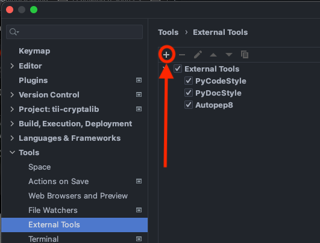
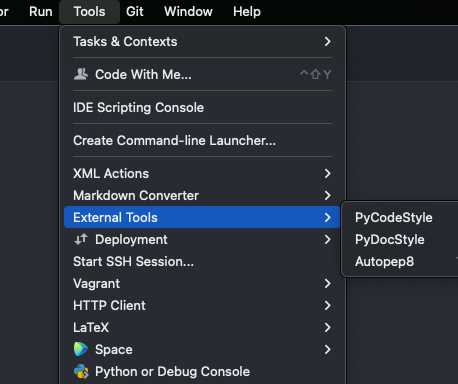
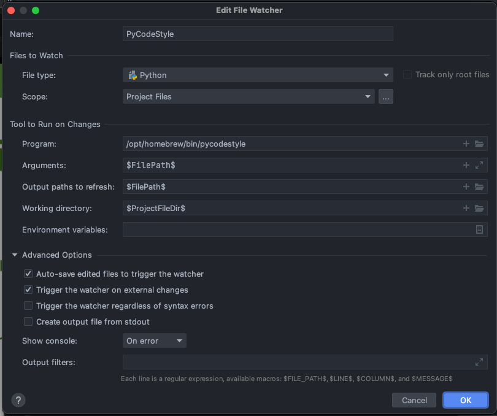

# Developer's Guide for CLAASP Library

In this manual, we provide a step-by-step guide to set up a development environment for 
CLAASP: Cryptographic Library for Automated Analysis of Symmetric Primitives and how to contribute to the project.

## Installation

Download the source from the git repository:

```
     $ git clone https://github.com/Crypto-TII/claasp.git
     $ cd claasp/
```

CLAASP library is built on the top of SageMath, and it will try to pick the `sage` binary from `PATH`
environment variable. Alternatively, you can specify different sage binary in the file `SAGE_BIN_PATH` 
if you want to use other version of SageMath.

There are two different ways of getting the library ready to use, using docker or installing the dependencies on your 
machine. If you choose to use Docker, the dependencies will not be installed. These will remain inside your docker 
image and will be deleted as soon as you delete that image.

### Docker

In order to use this approach you need to have [docker](https://www.docker.com/) installed and up in your machine.
After we have installed and opened it we can run this command in the terminal, which will create the image and launch 
the container:

- In case you use a macOS machine with Apple Silicon chip (arm64), you need to run the command
   ```make rundocker-m1```

- Otherwise, run ```make rundocker```

After the installation, we need to enter to the sage terminal with the command:

   ```sage```

After that we are ready to go and can use the library as specified in the [usage](#usage) section.

### Manual installation
To install the dependencies manually, you only need to execute the following script from the 
root directory of the project:

    $ ./configure.sh

## Setting up PyCharm


The following instructions have been tested with 
```angular2html
PyCharm 2021.2 (Professional Edition)
Build #PY-212.4746.96, built on July 27, 2021
```
1. Download and install [PyCharm](https://www.jetbrains.com/pycharm/download).

### Python interpreter

2. Determine location of the Python executable inside your sage package:
   1. open a terminal and type: 
   `sage -python` to open the Python shell from the sage package.
   2. within the Python shell, type: 
```angular2html
>>> import sys
>>> sys.executable
# the output will be a path similar to this: '/your_sage_python_path/bin/python3'
```
3. Run PyCharm and open the `claasp/` directory
 
4. We will now set up PyCharm to use the Python 3 interpreter of SageMath
   1. Click `PyCharm` menu in the top-left toolbar and select `Preferences...`
   2. Click the drop-down menu of `Project: claasp` and select `Python Interpreter`
   3. Click the little-gear icon in the top-right corner next to the drop-down list of available interpreters and
      select `Add...`
   4. Select `Existing Environment`
   5. Click the `...` menu next to the drop-down list of interpreters
   7. Browse to the path found in point 2.
   8. If you set up the `PATH` environment variable correctly, PyCharm should successfully execute SageMath Python 3
      interpreter and populate list of packages installed.

After the steps above, you should now be able to:
1. Click on `Add Configuration...`.
2. Click on `Add new run configuration...`.
3. Select "Python".
4. Add the file to be run/debugged in the field "Script Path".

### Linter

Set up a linter and a formatter tool in order to follow best practises as specified in further sections.

### Makefile configuration

Configure PyCharm's Makefile Plugin

1. Click `PyCharm` menu in the top-left toolbar and select `Preferences`
2. Go to `Plugins`
3. Install the `Makefile language` plugin

To use the targets in the Makefile, or to run the test for a specific module, you need to set a build configurations by
   following the steps below:

1. Click 'Run' in the top toolbar and select `Edit configurations`
2. Click the symbol `+` to add a new build configuration and choose `Makefile`
3. In the field `Name`, type the name of the configuration
4. In the field `Makefile`, choose the Makefile in the root folder of `claasp`
5. In the field `Targets`, choose the target you want to run (e.g. all, install, uninstall, etc)
6. In the field `Arguments`, type the argument you want to pass when `make <target>`. For examples, if you want to run
   the tests for `claasp/cipher_modules/algebraic_tests.py`, set `test` in the field `Targets` and type 
   `MODULE=claasp/cipher_modules/algebraic_tests.py` in the field `Arguments`.
7. In the field `Working Directory`, choose the root folder of `claasp`

## How to Configure linter and formatter
Developers use apps to help us improve the quality of our code. As every programming language has its own standards and good practises, we can take advantage of that and set/follow rules that can be automatically analysed and improved by our IDE (Integrated Development Environment).

In our case, in order to follow the best practises recommended for our (python) code we use the **Python standard** known as [PEP 8](https://peps.python.org/pep-0008/).

There are plenty of **tools** that can help you to follow this standard. We have chosen the following:

- Linter: reviews the code and documentation syntax based on the standard *pep8*. We will use *[pycodestyle](https://github.com/PyCQA/pycodestyle) + [pydocstyle](https://github.com/PyCQA/pydocstyle)*
- Formatter: automatically formats Python code. We will use *[autopep8](https://github.com/hhatto/autopep8)*, which uses the [pycodestyle](https://pypi.org/project/pycodestyle/) utility to determine what parts of the code needs to be formatted to conform to the [PEP 8](https://www.python.org/dev/peps/pep-0008/) style guide.

In order to configure this in our IDE we can follow the next steps:

1. Install the tools in your computer:
    1. [pycodestyle](https://pypi.org/project/pycodestyle/)
    2. [pydocstyle](https://pypi.org/project/pydocstyle/)
    3. [autopep8](https://pypi.org/project/autopep8/)
2. Create in the root of your project a **setup.cfg** file which will contain the configuration that the linter will follow.
    1. Example of the syntax of this file:
        
        ```
        [pycodestyle]
        max-line-length = 120
        
        [pydocstyle]
        ignore = D100, D101, D102, D107
        ```
        
        - Line 1 indicates the linter (for the code) that will be used to analyse the code.
        - Line 2 (in this example) overrides the default config for the max line length and sets it to 120 chars.
        - Line 4 indicates the linter for the documentation that will be used to analyse the documentation.
        - Line 5 tells the linter to ignore some specific [rules](https://pycodestyle.pycqa.org/en/latest/intro.html#error-codes) set by default (that how we can customise our analysis to ignore some rules that we disagree with or we want to ignore for the time being).
        
        If you have doubts of how to use these tools you can always go to the shell/bash/terminal in your computer and use the *help documentation* in order to see the options you have got to add to this setup file. Typing for example:
        
        ```
        pydocstyle --h
        ```
        
3. We need to define the linter (**pycodestyle**) as an *External Tool*. (**Preferences → Tools → External Tools**). Click on the + symbol. (*A new window will be opened. The config below needs to be applied)*
    
    
    
    1. *Name*: your desired Name
    2. *Description*: your description
    3. *Program*: the location of the linter in your computer. (You can use the command *where* in bash to get it)
    4. *Arguments*: **$FilePath$**
    5. *Working directory*: **$ProjectFileDir$**
   
    

4. Same with **pycodestyle**:

    

5. Same with **autopep8**, but with some changes in the values:
    1. *Name*: your desired Name
    2. *Description*: your description
    3. *Program*: the location of the formatter in your computer. (You can use the command *where* in bash to get it)
    4. *Arguments*: **$FilePath$ -i -a -a**
        1. In this case, we put 2 flags that refer to:
            1. **i** : is the —in—place option
            2. **a**: defines the level of aggressiveness with which we want the analysis to be carried out. How many more -a, more level of aggressiveness.
    5. *Working directory*: **$ProjectFileDir$**
   
    

6. With this configuration, the tools could be used from the IDE from the menu *Tools*

    

    1. But, we would like the IDE to analyse and format automatically the files without us forcing it. So the next step would be defining the tools as *File Watchers*:
    2. Click on the + symbol and press in *<custom>* (*A new window will be opened. The config below needs to be applied)*
   
    

    3. To define the **pycodestyle**:
        1. *Name*: your desired Name
        2. *File type*: **Python**
        3. *Scope*: Project Files
        4. Program: the location of the formatter in your computer.
        5. *Arguments*: **$FilePath$**
        6. *Output paths to refresh*: **$FilePath$**
        7. *Working directory*: **$ProjectFileDir$**
   4. The same with the same values with **pydocstyle**:
   
       
   
       1. And **autopep8:**
      
       
   
7. In this way, the linter will perform analysis automatically whenever there are changes in a file, and the formatter will format the code automatically if we have autosave activated. So we need to activate it:


**With all this set, every time the code is saved, it will be analysed and formatted following the rules of PEP 8 and/or specified in the setup.cfg file.**

## How to use linter and formatter from the shell

Developers use apps to help us improve the quality of our code. As every programming language has its own standards and good practises, we can take advantage of that and set/follow rules that can be automatically analysed and improved by our IDE (Integrated Development Environment).

In our case, in order to follow the best practises recommended for our (python) code we use the **Python standard** known as [PEP 8](https://peps.python.org/pep-0008/).

There are plenty of **tools** that can help you to follow this standard. We have chosen the following:

- Linter: reviews the code and documentation syntax based on the standard *pep8*. We will use *[pycodestyle](https://github.com/PyCQA/pycodestyle) + [pydocstyle](https://github.com/PyCQA/pydocstyle)*
- Formatter: automatically formats Python code. We will use *[autopep8](https://github.com/hhatto/autopep8)*, which uses the [pycodestyle](https://pypi.org/project/pycodestyle/) utility to determine what parts of the code needs to be formatted to conform to the [PEP 8](https://www.python.org/dev/peps/pep-0008/) style guide.

The linter will follow the pep8 standard, but this standard can be slightly modified specifying some configuration in **setup.cfg** file that you can find in the root of your project.

Example of the syntax of this file:

```
1 [pycodestyle]
2 max-line-length = 120
3
4 [pydocstyle]
5 add-ignore = D100, D101, D102, D107
```

1. Line 1 indicates the linter (for the code) that will be used to analyse the code.
2. Line 2 (in this example) overrides the default config for the max line length and sets it to 120 chars.
3. Line 4 indicates the linter for the documentation that will be used to analyse the documentation.
4. Line 5 tells the linter to ignore some specific [rules](https://pycodestyle.pycqa.org/en/latest/intro.html#error-codes) set by default (that how we can customise our analysis to ignore some rules that we disagree with or we want to ignore for the time being).

In order to be able to run the linter/formatter from the shell, open a new one and follow the instructions below to install them. You have also some examples on how to run each tool in its section.

### **pycodestyle**

Installation: [https://pypi.org/project/pycodestyle/](https://pypi.org/project/pycodestyle/)

```
**pip install pycodestyle**
```

Documentation: [https://pycodestyle.pycqa.org/en/latest/intro.html](https://pycodestyle.pycqa.org/en/latest/intro.html)

Command (this command needs to be executed in the shell from the path where the file/folder we want to analyse is located):

```
pycodestyle <file or folder>

# Examples:
# pycodestyle cipher.py
# pycodestyle iterative_cipher_classes/
```

### **pydocstyle**

Installation: [https://pypi.org/project/pydocstyle/](https://pypi.org/project/pydocstyle/)

```
**pip install pydocstyle**
```

Documentation: [http://www.pydocstyle.org/en/stable/](http://www.pydocstyle.org/en/stable/)

Command (this command needs to be executed in the shell from the path where the file/folder we want to analyse is located):

```
pydocstyle <file or folder>

# Examples:
# pydocstyle cipher.py
# pydocstyle iterative_cipher_classes/
```

### **autopep8**

Installation: [https://pypi.org/project/autopep8/](https://pypi.org/project/autopep8/)

```
**pip install autopep8**
```

Documentation: [https://github.com/hhatto/autopep8](https://github.com/hhatto/autopep8)

Command (this command needs to be executed in the shell from the path where the file/folder we want to analyse is located):

```
autopep8 --in-place --aggressive --aggressive <file or folder>

# Examples:
# autopep8 --in-place --aggressive --aggressive cipher.py
# autopep8 --in-place --aggressive --aggressive iterative_cipher_classes/
```

Flags we use in the command above: 

- *--in-place*: makes changes to files in place.
- *--aggressive --aggressive:* defines the level of aggressiveness with which we want the analysis to be carried out. (More amount of *-a* = more level of aggressiveness.)

***Note:*** If you have doubts of how to use these tools you can always go to the shell/bash/terminal in your computer and use the *help documentation* in order to see the options you have to add to this setup file. Typing for example:

```
pydocstyle --h
pycodestyle --h
autopep8 --h
```

## Learn good practises
This section is meant to congregate a list of best practices while developing. The purposes of implementing these in our daily basis are:

- Keep an homogeneous code style throughout the project
- Follow most of PEP8 standard rules
- Make code easier to read and understand
- Reduce tendency to errors
- Improve performance

Here is the list of the practices we recommend:

- Linter/Formater
- Imports
- File arrangement
- Comments and dead code in the code
- Nomenclature
- Single quotes VS double quotes
- Single _ VS Double __
- C code

### Linter/Formater
A best practice while developing is having a linting and a formating tool to help you follow the standard guidelines. 
We have developed a guide on how to set [pycodestyle(linter)](https://pypi.org/project/pycodestyle/) and 
[autopep8(formater)](https://pypi.org/project/autopep8/) in PyCharm and how to use it.

### Imports
- PEP8 states a best practice to separate the end of the imports with the class or module definition by two blank lines. 
- This improves readability and clearer knowledge of where the imports start and where they end.
   ```
   import numpy as np
   
   
   class Calculator:
   ```
- We should avoid to declare imports as:
   ```
   from numpy import *
   ```
   These type of imports bring everything that that module/file contains, even its own imports. This makes the cost of executing the code higher as it needs to resolve every import. Imagine that the module you are importing is importing other modules itself with this nomenclature, this can lead to cyclical imports or, in the worst case scenario, to import your hole project in the file without you even knowing. We should only import what we strictly need.
- When we need certain imports to make our string code to work, instead to adding them to the global imports, try to import them where it is required only. This will help us when we try to understand the code where those imports are really used. If we specify them globally but they are only used in string code, probably our IDE will point to us that those imports are not used when they actually are.
   ```
   cipher_code_string = ""
   cipher_code_string += "from copy import copy\n"
   cipher_code_string += "from bitstring import BitArray\n"
   cipher_code_string += "\n"
   cipher_code_string += "def copy_array(input):\n"
   ```
   This way of adding imports should also follow the recommendations described in this section.
- If we need to add a line of imports that is very long, specify those imports between parenthesis, this will help the formatter to split the import into multiple lines.
   ```
   from tii.graph_representations.name_mappings import (INTERMEDIATE_OUTPUT,\
    CIPHER_OUTPUT, CONSTANT, WORD_OPERATION, MIX_COLUMN, SBOX)
   ```

### File arrangement 
- PEP8 states a best practice to leave a blank line at the end of the file.
- Avoid writing infinite lines. PEP8 aims to have lines of less than 79 characters, we know that because of the nature of the project this would be nearly impossible to achieve, but we consider that writing lines of no more than 120 characters can be achievable. This would mean a major improvement in readability.

### Comments and dead code in the code
It is **not recommended** to write comments in the code unless they explain something specific that the code can't explain.

It is a **bad practise** having commented code. When a piece of code is not needed, it needs to be removed. In case the programmer wants to recover it, he/she can do it from the version system control (Git).

### Nomenclature 
- Variables, file names and methods should follow the same nomenclature, as specified by PEP8, this means to write them in snake_case avoiding usage of uppercase letters.
- On the contrary, for class naming we should use CamelCase avoiding the usage of underscore to separate the words.

### Single quotes VS double quotes
Below you can find what it is considered best practises, but ***the most important thing*** in this case, it is making an agreement among the team in order to use them in the same way, whether following best practises or not.

- Single quotes: it's a best practice to use them to surround small and short strings, such as string literals or identifiers. But it's not a requirement. You can write entire paragraphs and articles inside single quotes. Example:
   ```
   name = 'Bob'
   print(name)
   
   channel = 'Better Data Science'
   print(channel)
   
   paragraph = 'Bob likes the content on Better Data Science. Bob is cool. Be like Bob.'
   print(paragraph)
   ```
- Double quotes: It's considered a best practice to use them for natural language messages, string interpolations, and whenever you know there will be single quotes within the string. Example:
   ```
   name = 'Bob'
   
   # Natural language
   print("It is easy to get confused with single and double quotes in Python.")
   
   # String interpolation
   print(f"{name} said there will be food.")
   
   # No need to escape a character
   print("We're going skiing this winter.")
   
   # Quotation inside a string
   print("My favorite quote from Die Hard is 'Welcome to the party, pal'")
   ```

### Single _ VS Double __
- The use of single underscore is related to protected variables and methods, this means that no other object or method is able to reach them unless they are part of a child object (Inheritance).
- Double underscores are used to state that methods are private and no other objets can use them even if they are children.
- In this **project** we have agreed to only use **Single underscore** notation for both purposes. 

### C code
- PEP8 has a specific guideline on how to deal with [C code in the C implementation of Python](https://peps.python.org/pep-0007/).

## Contributing to the Project

1. Create a new ticket in JIRA
2. Set the `Project` field to be **Cryptographic Library for Automated Analysis of Symmetric Primitives (CLAASP)**
3. If the issue created is considered to be collection of many small tasks, then select `Story` as the `Issue Type`.
   Otherwise, set it to `Task` or a `Bug` depending on the context.
4. Give short description in the `Summary` in the following format
   ```
       <type>: <description>
   ```
   where `<type>` is either `feature`/`doc`/`bug`/`other`, i.e. "bug: incorrect computation of Walsh transform".
5. Set the appropriate `Due Date`
6. Give a clear and concise explanation of the issue in the `Description`
7. Select the `Fix Version` of the module
8. Put relevant keywords in the field `Labels`
9. If it is necessary to link the issue with existing ones, fill both the `Linked issue` and the `Issue` field.

Now suppose that you want to work on a ticket. We must associate the ticket to a specific branch in `claasp`
repository in the following way

1. Go to the ticket that you want to work on
2. In the right pane, select `Create branch`. You will be redirected to the Github.
3. Select the `claasp` in the `Repository` field
4. Choose `Custom` in the `Branch type`
5. Select the appropriate branch that you want to `Branch from`. Generally, this should be set to `main` or `develop`.
6. In the `Branch name`, make sure that it is filled with the same ID as the ticket, i.e. `LIBCA-26`.
7. Click `Create branch`

You may now work on changes you want to do on that specific branch you just created. Once this is done, create a pull
request and assign someone to review the changes. Do not forget to also change the `Assignee` field in the ticket to the 
person in charge of reviewing your code. If you are the reviewer, make sure that the changes in the pull request follows
[SageMath coding convention.](https://doc.sagemath.org/html/en/developer/coding_basics.html)

We agreed on some specifics that do not follow the convention linked above. These are:

- Both protected/private methods will have the suffix `_`.
- Component names like AND, OR, etc. inside a method name will always be in capital letters. `add_AND_component()`
- Create a PR to `develp` branch only when the functionality is completed

## Executing the tests

If you want to run the unit tests for all submodules without rebuilding the library, just execute:

    $ make testall

To test a specific submodule, pass the path of the submodule to the `MODULE` variable in the Makefile. 
For instance, to run the unit tests for `claasp/cipher_modules/algebraic_tests.py` simply run:

    $ make test MODULE=claasp/cipher_modules/algebraic_tests.py

## Contributing to the documentation

You can add Documentation Strings in your code following the 
[SageMath documentation convention](https://doc.sagemath.org/html/en/developer/coding_basics.html#documentation-strings).

We agreed on some specifics that do not follow the convention linked above. These are:

- When specifying the type of input/output do it in bold. 
Like: ``` ``number_of_rounds`` -- **integer** (default: `1`); number of rounds for the cipher```.
- When adding an example tag, this needs to be exactly like `EXAMPLES::`, and leave an empty blank line before the 
example code.
- When there is no input to a method, ``None`` should be used to specify it 
- If the line is too long, it can be split in as many lines as needed, but always leaving 2 blank spaces of indentation.
```
run_avalanche_dependence_uniform -- **boolean** (default: `True`); if True, add the avalanche dependence
  uniform results to the output dictionary
```

If you need to add new references, you must insert them manually in the file `docs/references.rst` in order to build 
the documentation correctly.
